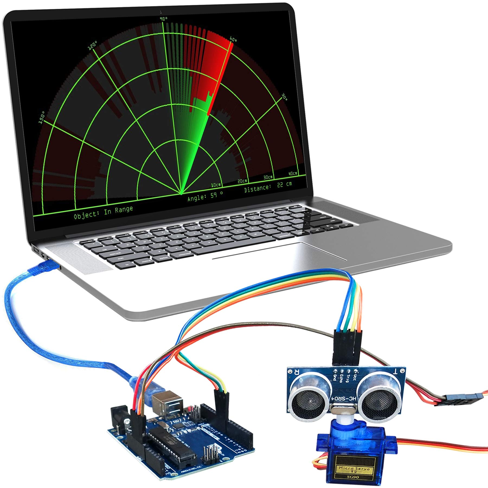
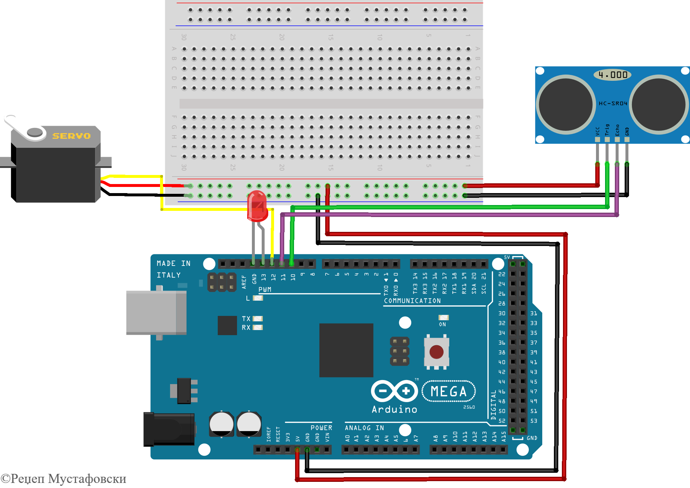
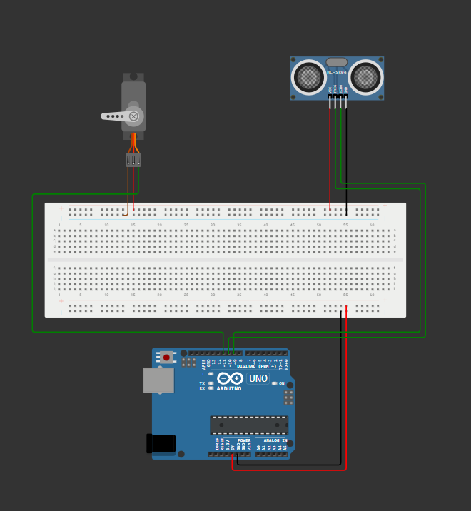

# RADAR SYSTEM USING ARDUINO UNO

<p align="center">
  
</p>

## Components Used

* Arduino UNO
* HC-SR04 Ultrasonic Sensor
* SG90 Servo Motor
* Breadboard
* Jumper Wires
* USB Cable

---

### Project Overview

This project demonstrates a Radar System using Arduino UNO, an HC-SR04 Ultrasonic Sensor, and an SG90 Servo Motor. The ultrasonic sensor continuously scans the surroundings by rotating through different angles using the servo motor. The measured distance data is processed and displayed as a radar-like visualization, enabling object detection within the scanning range.

### Hardware Components

| Component                 | Purpose                |
| ------------------------- | ---------------------- |
| Arduino UNO               | Main microcontroller   |
| HC-SR04 Ultrasonic Sensor | Distance measurement   |
| SG90 Servo Motor          | Rotates the sensor     |
| Breadboard                | Circuit prototyping    |
| Jumper Wires              | Electrical connections |
| USB Cable                 | Power and programming  |

---
---


# Introduction & Objective

## Introduction

A Radar System using Arduino is an Internet of Things (IoT)-based project that detects and monitors objects using an HC-SR04 ultrasonic sensor. The ultrasonic sensor is mounted on an SG90 servo motor, which rotates continuously to scan the surrounding area. The sensor measures the distance of nearby objects using ultrasonic waves and sends the data to the Arduino UNO. The collected information is then displayed in a radar-like visualization, allowing users to observe the position and distance of detected objects.

## Objective

The main objectives of this project are:

* To detect nearby obstacles and objects.
* To measure distance using ultrasonic waves.
* To perform 180° scanning using a servo motor.
* To visualize detected objects in a radar system interface.
* To demonstrate the practical application of IoT and embedded systems.

## Applications

This project can be used in various real-world applications, including:

1. **Security Systems** – Detecting intruders and monitoring restricted areas.
2. **Robotics** – Assisting robots in navigation and object detection.
3. **Obstacle Avoidance Systems** – Preventing collisions in autonomous devices.
4. **Smart Surveillance** – Monitoring environments efficiently.
5. **Industrial Monitoring** – Detecting objects and movements in industrial setups.

---


# Circuit Connections

## Connection Diagram
<p align="center">
  
</p>


## Arduino Mega ↔ Breadboard

| Arduino Mega Pin | Breadboard Connection |
| ---------------- | --------------------- |
| 5V               | Positive (+) Rail     |
| GND              | Negative (-) Rail     |

---

## HC-SR04 Ultrasonic Sensor Connections

| HC-SR04 Pin | Connected To            |
| ----------- | ----------------------- |
| VCC         | Breadboard + Rail (5V)  |
| GND         | Breadboard - Rail (GND) |
| Trig        | Digital Pin 9         |
| Echo        | Digital Pin 10          |

---

## Servo Motor Connections

| Servo Wire Color       | Connected To            |
| ---------------------- | ----------------------- |
| Red (VCC)              | Breadboard + Rail (5V)  |
| Black/Brown (GND)      | Breadboard - Rail (GND) |
| Yellow/Orange (Signal) | Digital Pin 11         |

---

## LED Indicator Connections

| LED Pin                | Connected To   |
| ---------------------- | -------------- |
| Anode (+, Long Leg)    | Digital Pin 13 |
| Cathode (-, Short Leg) | GND            |

---

## Pin Mapping Summary

| Arduino Pin | Component              |
| ----------- | ---------------------- |
| D13         | LED (+)                |
| D12         | Servo Signal           |
| D11         | HC-SR04 Echo           |
| D10         | HC-SR04 Trig           |
| 5V          | Breadboard Power Rail  |
| GND         | Breadboard Ground Rail |

---

## Wiring Notes

1. Arduino 5V is connected to the breadboard positive rail.
2. Arduino GND is connected to the breadboard negative rail.
3. The ultrasonic sensor receives power from the breadboard rails.
4. The servo motor receives power from the breadboard rails and its signal wire is connected to Digital Pin 12.
5. The ultrasonic sensor's Trig and Echo pins are connected to Digital Pins 10 and 11 respectively.
6. An LED is connected to Digital Pin 13 to indicate object detection.
---


## Circuit Diagram and Working

### Wokwi Circuit Diagram


<p align="center">
  
</p>


## Working Principle

The Radar System operates by combining an ultrasonic sensor and a servo motor controlled by an Arduino UNO.

### Working Steps

1. The SG90 servo motor rotates from **0° to 180°**.
2. The HC-SR04 ultrasonic sensor emits ultrasonic waves.
3. These waves travel through the air and strike nearby objects.
4. The waves are reflected back toward the sensor.
5. The sensor receives the reflected signal.
6. Arduino calculates the distance using the travel time of the ultrasonic waves.
7. The corresponding angle and distance values are recorded.
8. The scanning process repeats continuously, creating a radar-like visualization of the surrounding area.

### Flow of Operation

```text
Servo Rotates
      ↓
Ultrasonic Sensor Sends Pulse
      ↓
Object Reflects Pulse
      ↓
Sensor Receives Echo
      ↓
Distance Calculated
      ↓
Angle + Distance Recorded
      ↓
Radar Display Updated
      ↓
Repeat Continuously
```

---
---


# Results, Advantages and Conclusion

## Results

The Radar System was successfully developed and tested. The following results were achieved:

* Successful object detection was achieved.
* Distance measurement was performed accurately using the HC-SR04 ultrasonic sensor.
* Continuous scanning between **0° and 180°** was successfully implemented.
* Real-time obstacle monitoring was demonstrated.
* Reliable communication between the Arduino UNO, servo motor, and ultrasonic sensor was established.

## Advantages

The project offers several advantages:

* Low-cost implementation using readily available components.
* Easy to build, understand, and maintain.
* Provides real-time object detection and monitoring.
* Suitable for educational and IoT learning purposes.
* Can be expanded with additional sensors and communication modules.

## Future Enhancements

The functionality of the project can be improved by implementing the following features:

* Add buzzer alerts for obstacle detection.
* Integrate an OLED display for local distance visualization.
* Add Bluetooth monitoring using a Bluetooth module.
* Implement wireless communication for remote monitoring.
* Improve the scanning range and detection accuracy.
* Develop a mobile application for real-time monitoring and control.

## Conclusion

The Arduino-based Radar System successfully detects objects and measures their distance using an HC-SR04 ultrasonic sensor. The SG90 servo motor enables continuous area scanning, making the system useful for obstacle detection and basic surveillance applications.

This project demonstrates the practical integration of sensors, actuators, and microcontroller programming within an Internet of Things (IoT) environment. It serves as an effective learning platform for understanding embedded systems, distance measurement techniques, and real-time monitoring applications.

---

